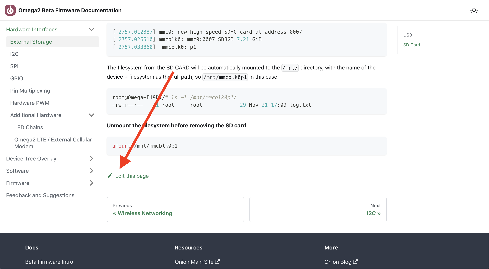

# Contributing

We welcome all feedback and suggestions, as well as Pull Requests!

## What kind of contributions we're looking for

The long-term goal of this Documentation site is to provide a central place for users to find technical documentation related to Development, Deployment, and Production of products based on the Omega2 family of modules.

With this in mind, contributions should:

1. Be generally useful to Omega users
1. Provide foundational knowledge - not tips and tricks 
1. Fix any errors or omissions in the existing articles

If you're unsure, please create an issue and we can discuss it further.

## Issues

When opening a [new issue](https://github.com/OnionIoT/documentation/issues/new/choose), always make sure to fill out the issue template. This step is very important! 

This makes it easy for us to get the full picture of what you're describing. 


## Pull Requests

Once your changes are ready to be contributed back upstream, you can do that by opening a Pull Request. We will do our best to work with you and get the PR looked at.

Please make sure the following is done when submitting a pull request:

1. Keep your PR small. Small pull requests (~300 lines of diff) are much easier to review and more likely to get merged. Make sure the PR does only one thing, otherwise please split it.
1. Use descriptive titles
1. If the PR is related to an Issue in this repo (or even another repo), make sure to link to the Issue in your PR message
1. Test your changes

All pull requests should be opened against the `main` branch.

## Making Contributions

This section outlines the practical side of making contributions to this documentation repo.

### General Info

All doc articles are available in the `docs/` directory of this repo. The files are written in markdown and have `.md` exensions. 

In order for articles to be listed in the sidebar on the site, the `sidebars.js` file needs to be modified.

* **Markdown Syntax:** MDX is the parsing engine, which can do much more than just parsing standard Markdown syntax, like rendering React components inside  documents as well. More information here: https://docusaurus.io/docs/markdown-features
* **Sidebar:** The `sidebars.js` file determines the categories and ordering of documentation articles and categories on the side. To learn more, see https://docusaurus.io/docs/sidebar

### Editing a Docs Article

All docs articles can be found in the `docs/` directory. 

A document's URL location on `https://documentation.onioniot.com/` is its file path relative to the docs folder in this repo.

For example:
* URL for article: `https://documentation.onioniot.com/hardware-interfaces/external-storage`
* Path to markdown file `docs/hardware-interfaces/external-storage.md`

Make any edits as necessary and submit a Pull Request with:
* A brief description of the changes
* Why you believe this change is necessary

#### Alternative

If you have the URL of an article but you're struggling to find the path to the article in this repo, head to the bottom of the article in your browser and click on **Edit this page**:



It will lead to the corresponding file on GitHub.

### Adding a Docs Article

Adding a new docs article involes: 

1. Making a new markdown file
2. Adding it to the sidebar definition

#### Step 1: Making a New Markdown File

1. Create a new markdown file. 
2. To keep the docs articles organized, the new file should be nested in a directory that corresponds to it's category. Keep in mind the file path relative to `docs` in this repo will impact the doc article's URL.
3. Populate the Markdown file with the article contents. See the following for supported Markdown features: https://docusaurus.io/docs/markdown-features
4. Populate the **Front Matter** of the article. The front matter must define the Title of the article as this will show up in the side bar. Example of front matter below. See the following for more info: https://docusaurus.io/docs/create-doc#doc-front-matter. 

```
---
title: My Article Title
---
```

#### Step 2: Adding it to the Sidebar Definition

The `sidebars.js` file defines the content of the sidebar. This includes the categories, which articles appear in which category, and the order of articles and categories.

See the Docusaurus sidebar documentation for more details: https://docusaurus.io/docs/sidebar

### Adding a Category

Occasionally, a new category will need to be added to the documentation site. 

To add a new category:

1. Create a new directory under `docs`, give it a descriptive name (with no spaces) to match the document category name
2. Update the `sidebars.js` file that defines the categories to add the new category and docs articles that are part of the category


> For more info on the Sidebar definition file, see [the section above](#step-2-adding-it-to-the-sidebar-definition)

### Testing your Changes Locally

Test all of your changes locally to make sure they render properly on the website.

See the **Developing** section in the [README](./README.md) for information on how to build the site on your local machine. Any modern computer with NodeJS installed will be able to handle building this site.