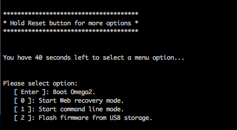

import { GiscusDocComment } from '/src/components/GiscusComment';
import BootloaderUpgradeWarning from './_bootloader-upgrade-warning.mdx';

This article shows how to use the (new) bootlaoder to upgrade to an even newer version of the bootloader.

This is useful for:
- Upgrade to a newer U-Boot release.
- (Advanced) Test a custom or development build.

This guide applies to any Omega2 that is **already running the modern bootloader** and takes less than a minute of actual device time.

<BootloaderUpgradeWarning/>


## Step 1: Gather Requirements

Gather the requirements:
- The target Omega2 device with access to the following:
    - serial command line
    - ethernet port
    - reset button (GPIO38)
    - Note: Access to all of the above is provided on the Omega2 Eval Boards
- A host computer
- Ethernet Cable
- USB cable to connect to the Omega

## Step 2: Computer Setup

#### Serial Command‑Line Drivers Installed
import ComputerSetupSerialDrivers from './_computer-setup-serial-drivers.mdx'

<ComputerSetupSerialDrivers/>

#### Configure the Ethernet Network
import ComputerSetupEthernetStaticIp from './_computer-setup-ethernet-static-ip.mdx'

<ComputerSetupEthernetStaticIp/>

#### Install TFTP Tools
import ComputerSetupTftpTools from './_computer-setup-tftp-tools.mdx'

<ComputerSetupTftpTools/>

## Step 3: Download the Bootloader Binary

import BootloaderDownloadUbootImage from './_bootloader-download-uboot-image.mdx'

<BootloaderDownloadUbootImage />

## Step 4: Start the TFTP Server
In the download folder run:

```bash
ntftp 0.0.0.0 -l .
```

## Step 5: Enter the Bootloader Command Line

import StopAutobootInstructions from './_stop-autoboot-instructions.mdx'

<StopAutobootInstructions/>

import StopAutobootOutcome from './_stop-autoboot-outcome.mdx'

<StopAutobootOutcome/>

:::caution

If the bootloader looks like this screenshot: 



Then the device is running the old bootloader. See instead the [article on Upgrading the Old Bootloader](/bootloader/upgrading-old-bootloader)

:::

## Step 6: Transfer the Bootloader Image to the Omega2

Copy the new bootloader image from the host computer to the Omega2 RAM.

First set the `bootfile` environment variable to the bootloader image filename on the host computer from Step 3:

<!-- TODO: change bootloader image filename to a default value -->

```
env set bootfile <BOOTLOADER IMAGE FILENAME>
```

Then start the file transfer over TFTP:

```
tftpboot
```

U‑Boot prints the file size and the RAM address where it was loaded.

## Step 7: Prepare Flash & Erase the Old Bootloader


<BootloaderUpgradeWarning/>

Initialize the flash:

```
sf probe
```

Clear the existing environment variables:
```
sf erase u-boot-env 0x10000 
```

Finally, erase the existing uboot
```
sf erase u-boot 0x30000
```

Each step only takes a moment.

## Step 8: Write the New Bootloader

Now write the new bootloader to the flash:

```bash
sf update $loadaddr u-boot $filesize
```

The write will take less than 5 seconds. A success message confirms the write:

```
=> sf update $loadaddr u-boot $filesize
device 0 offset 0x0, size 0x2fa59
195161 bytes written, 0 bytes skipped in 2.485s, speed 80323 B/s
```

## Step 9: Reboot and Confirm

Reboot the device by running 

```bash
reset
```
Watch the boot log. The first line should now show the new build date, for example:

```
U-Boot 2025.04 (May 10 2025 – 12:34:56)
```

<!-- TODO: update this date above when new bootloader is available -->

import BootLogSample from './_bootloader-boot-log-sample.mdx'

<BootLogSample/>

## What’s next?
- [Activating the Bootloader Command Line](/bootloader/activating-bootloader)
- [Flashing Firmware over Ethernet](/bootloader/flashing-firmware-over-ethernet)

<GiscusDocComment />
