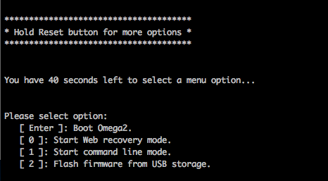

import Tabs from '@theme/Tabs';
import TabItem from '@theme/TabItem';
import { GiscusDocComment } from '/src/components/GiscusComment';

This guide will show how to upgrade an Omega2 module with the previous bootloader to the new, modern, u-boot-based bootloader. 

:::danger

Updating the bootloader has the potential to be a destructive action and can lead to a device becoming unsable. 

Take care to ensure:
- The bootloader binary to be flahed is not corrupted and has been confirmed to be working
- The Omega2 device remains powered on during the update

Onion is not responsible for damage to any devices.

:::

## How do I know if my Omega2 has the Old Bootloader?

[Connect to the Omega2 command line through serial](/quickstart/serial-command-line). Then power on the device **and** press the SW Reset button at the same time. 

:::info

The Reset button is connected to the active-high FW_RST/GPIO38 pin. Pressing the reset button sends a digital-high signal to the FW_RST/GPIO38 pin.

:::

If the serial command line shows a menu like the one below, the device is running the old version of the bootloader:




## Upgrade Procedure

The upgrade procedure involves using the web recovery feature of the previous bootloader to flash the new bootloader to the Omega’s internal memory. 

You will need access to the reset button (GPIO38), the serial console on UART0, and the Ethernet port to make use of the web recovery feature.

### Step 1: Gather Requirements

Gather the requirements:
- The target Omega2 device with access to the following:
    - serial command line
    - ethernet port
    - reset button (GPIO38)
    - Note: all are provided on the Omega2 Eval Boards
- A host computer
- Ethernet Cable
- USB cable to connect to the Omega

### Step 2: Computer setup

#### Serial Command Line Drivers Installed

Follow the instructions in [step 1 of the connecting to serial command line article](/quickstart/serial-command-line#step-1-install-usb-to-serial-driver-on-your-computer) to install the drivers required to use the serial command line

#### Configure the Ethernet Network

Configure your computer’s ethernet network to manually set its IP address to `192.168.8.100` and subnet mask to `255.255.255.0`. By doing so, your computer will be able to communicate with the Omega over ethernet while it is in web recovery mode.

TODO: decide if including steps to setup ethernet here

### Step 3: Download the New Bootloader Binary

TODO: update this section when bootloader binaries are uploaded if necessary

Download the bootloader binary that will be flashed to the target device.

In a web browser, navigate to http://repo.onioniot.com/omega2/bootloader/v2025.04

If the target device is an **Omega2 (OM-O2) or Omega2S (OM-O2S)**, download the binary with the name `onion_omega2_u-boot-with-spl.bin`

If the target device is an **Omega2+ (OM-O2P) or Omega2S+ (OM-O2SP)**, download the binary with the name `onion_omega2p_u-boot-with-spl.bin`

### Step 4: Activate Web Recovery Mode

Connect the target Omega to the host computer with the ethernet cable. But do not power on the device just yet!

TODO: reuse these steps??

[Connect to the Omega2 command line through serial](/quickstart/serial-command-line). Then power on the device **and** press the SW Reset button at the same time. 

:::info

The Reset button is connected to the active-high FW_RST/GPIO38 pin. Pressing the reset button sends a digital-high signal to the FW_RST/GPIO38 pin.

:::

This will activate the (old) bootloader and display a menu of options:


Activate **Web Recovery Mode** by pressing `0`. After pressing `0`, you should see the following output:

```
Bringing Eth0 (10/100-M) up...

RT2880 ETH setup done.

HTTP server starting at 192.168.8.8 ...

HTTP server is up and running.
```

### Step 5: Flash the New Bootloader

Open a browser on the host computer and navigate to `192.168.8.8/uboot.html`. It will display a page like this:


Next, press the **Choose File** button to select the bootloader binary downloaded in [Step 3 above](#step-3-download-the-new-bootloader-binary). 

TODO: reuse this warning??

:::danger

Updating the bootloader has the potential to be a destructive action and can lead to a device becoming unsable. 

Take care to ensure:
- The bootloader binary to be flahed is not corrupted and has been confirmed to be working
- The Omega2 device remains powered on during the update

Onion is not responsible for damage to any devices.

:::

When you’re ready, press the **Update!** button. The serial command line will show messages like this:


### Step 6: Update Complete

The update will take about 15 seconds, the device will restart when the update is complete. 

The Omega will boot normally if everything went according to plan.

TODO: add example boot logs with new bootloader?

TODO: add links to next articles?

<GiscusDocComment />