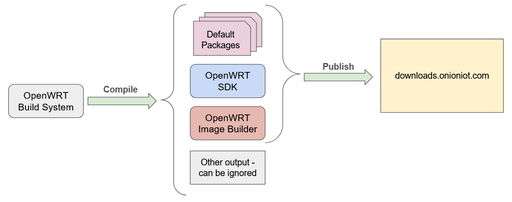
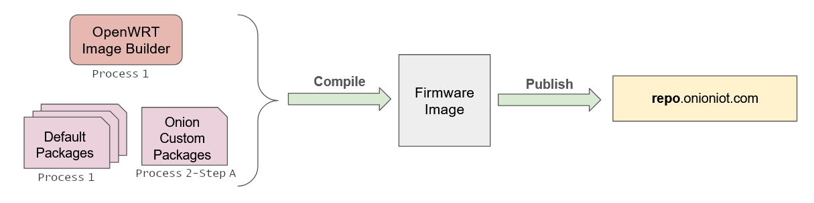

import { GiscusDocComment } from '/src/components/GiscusComment';

Onion firmware based on OpenWRT 23.05 is built using two different processes. <!-- TODO: update with OPENWRT_VERSION variable -->

**Process 1:**

The OpenWRT Build System is used to build all default packages, our custom OpenWRT SDK, and our custom OpenWRT Image Builder.

**Process 2:**

**Step A:** Our custom OpenWRT SDK is used to build Onion's custom packages.

**Step B:** Our custom OpenWRT Image Builder is used to build firmware images for Omega2.

:::note

Onion runs the first process periodically and runs the second process each time we release new firmware.

:::

## Process 1: OpenWRT Build System

In the first process, the OpenWRT Build System builds:

- All default packages
- Onion's custom OpenWRT SDK
- Onion's custom OpenWRT Image Builder

### Why customize the Build System?

The OpenWRT organization also provides an SDK and Image Builder. However, these tools are based on the vanilla OpenWRT Build System. It is possible to build packages and create firmware using them, but they only provide control over the general configuration and which packages to include in the firmware – deeper changes cannot be made.

Using a custom build system to create a customized version of the SDK and Image Builder provides more flexibility when building packages and firmware. This allows for changes to the kernel and system configuration.

Some examples include making changes to:

- Support FPU emulation in the kernel to build and use modern Node.js.
- Make setting changes in the kernel configuration, such as enabling the `/dev/mem` device used for [pin multiplexing](/hardware-interfaces/pin-multiplexing).
- Building additional kernel modules that are not part of the Linux kernel.
- The freedom to add patches created by yourself and other developers to try out changes quickly and efficiently.

:::note

The Omega2 family is the only MIPS platform that supports modern Node.js.

:::

### Where is the Build System source code?

All customizations to the Build System that are used to compile our SDK and Image Builder are publicly available on GitHub: [https://github.com/OnionIoT/OpenWRT-buildsystem-wrapper](https://github.com/OnionIoT/OpenWRT-buildsystem-wrapper)

Our customizations are based on patches to the Build System. This is intentional and easier than maintaining our own fork of the Build System, which makes it straightforward to port our customizations to new releases of OpenWRT.

For usage instructions, see the [README in the Github repo](https://github.com/OnionIoT/openwrt-buildsystem-wrapper).

### Where is the Build System output?

Onion's custom OpenWRT Build System is compiled by our CI system and the output placed in the download section of our website at [http://downloads.onioniot.com/](http://downloads.onioniot.com/).

The Build System output is available on our website:

- Default packages - http://downloads.onioniot.com/releases/23.05.3/packages/mipsel_24kc/
- Compiled versions of the SDK and Image Builder - http://downloads.onioniot.com/releases/23.05.3/targets/ramips/mt76x8/

<!-- TODO: update above with OPENWRT_RELEASE variable -->

:::note

The release directory also has firmware images. You can safely ignore these, as they are vanilla versions of the OpenWRT.

:::

## Process 2 - Step A: Onion-customized OpenWRT SDK

In step A of the second process, we use the Onion-customized OpenWRT SDK to build Onion's custom packages.

One of the core tenets of Onion device firmware is to localize all customizations in packages. This makes it easy to port the changes to new releases and reduces the number of "fronts" that must be maintained.

Our goal is to create custom packages that bring value to our customers, by making them easy to use or by adding more functionality. Examples of this are the **default network configuration** and the **gpio muxing utility**.

The SDK has a wrapper around it, which makes it easier to interact with the SDK. By default, it uses the Onion-customized OpenWRT SDK, and compiles packages from the `openwrt-23.05` branch of the `OnionIoT/OpenWRT-Packages` GitHub repository. 
<!-- TODO: update above with OPENWRT_VERSION variable -->

### Where is the source code?

The source code can be found on GitHub: https://github.com/OnionIoT/OpenWRT-Packages/tree/openwrt-23.05
<!-- TODO: update above with OPENWRT_VERSION variable -->

The `openwrt-sdk-wrapper` repo easily and quickly compiles packages using the Onion OpenWRT SDK: https://github.com/OnionIoT/openwrt-sdk-wrapper

The `profile` config file defines which SDK to use, the version of the SDK, the package feed, and which packages from the package feed to compile.

Onion's package repo is built using the default version of the `profile` config file.

### Where is the package output?

Our CI system uses Onion's custom OpenWRT SDK to compile packages and the output is placed in the repo section of our website. 

The compiled packages can be found at: http://repo.onioniot.com/omega2/packages/openwrt-23.05.3/ <!-- TODO: update above with OPENWRT_RELEASE variable -->

## Process 2 - Step B: Onion-customized OpenWRT Image Builder

In step B of the second process, we use the Onion-customized OpenWRT Image Builder to build firmware images.

The compiled firmware images include:

- The default packages.
- Onion's custom packages.

We use a wrapper to interact with the OpenWRT Image Builder, which makes it easy to build firmware. By default, the wrapper is set up to use the Onion-customized Image Builder that is built in the first process. 

**Note:** You can instead use the vanilla Image Builder from OpenWRT to build firmware.

### Where is the Image Builder source code?

The `openwrt-imagebuilder-wrapper` repo builds firmware images for the Omega2 and Omega2+ in a repeatable and maintainable way: [https://github.com/OnionIoT/openwrt-imagebuilder-wrapper](https://github.com/OnionIoT/openwrt-imagebuilder-wrapper)

The `profile` config file defines which Image Builder to use, the version of the Image Builder, which devices to create firmware for, the package repos to use, and which packages to include in the firmware.

Onion uses the default version of the `profile` config file to build the Omega2 and Omega2+ firmware.

### Where is the Image Builder output?

Our CI system uses Onion's custom OpenWRT Image Builder to compile firmware images and the output is placed in the repo section of our website.

The compiled firmware images can be found at: http://repo.onioniot.com/omega2/images/openwrt-23.05/
<!-- TODO: update above with OPENWRT_VERSION variable -->

<GiscusDocComment />

