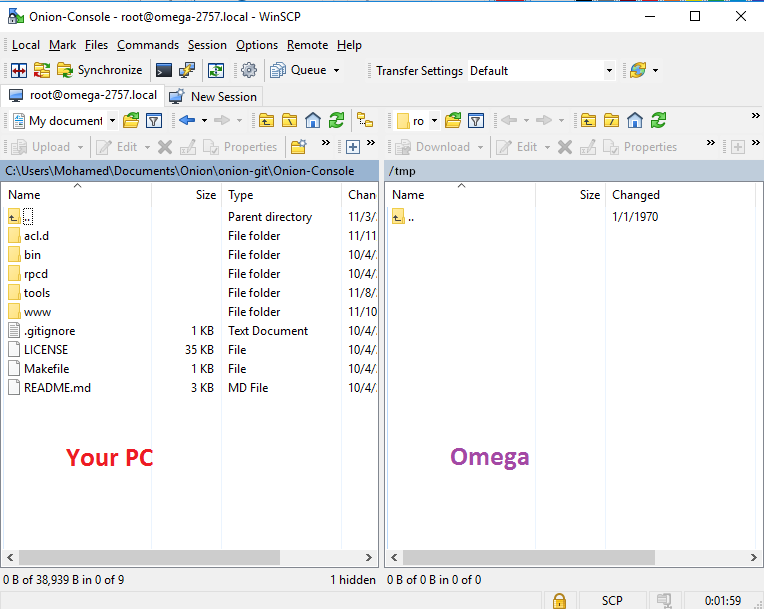

import Tabs from '@theme/Tabs';
import TabItem from '@theme/TabItem';
import { GiscusDocComment } from '/src/components/GiscusComment';

## Introduction

This guide will show how to compile a C program into a package for the Omega2, by using a Docker image that uses Onion's OpenWRT SDK wrapper. We'll demonstrate how this is done using a sample C program from Onion.

The C program sends an HTTP request to an API and then outputs the response to a terminal. The API response includes a To Do list item in JSON format.

### Output

Onion's sample program compiled into an ipk package file you can install on an Omega using the opkg package manager.

### Why is this important?

This guide and the sample program provide a sure-fire way to build a C program into a package. You can use the procedure and sample code to build your own custom packages based on C programs.

### How long will this take?

From start to finish, the example takes 15 minutes, assuming your development computer has all the required software installed.

## Environment set up

You will need the following set up and software installed to follow along with the example.

- A development computer  
  - Running Mac OS, Windows, or Linux.
  - Access to terminal/command line
  - Git installed
  - Docker installed and running
    - **Tip**: For those new to Docker, see [Docker's installation guide](https://docs.docker.com/desktop/) and the manual on [running a Docker container](https://docs.docker.com/engine/reference/run).

    - **Important Note on Macs with Apple Silicon:** The OpenWRT build system, SDK, and Image Builder expect an x86_64 processor architecture. Attempting to build in a Docker container on a Mac with Apple Silicon will result in compilation errors. We recommend using an x86_64 machine for best results. Some users have reported successful compilation if Rosetta for x86/amd64 emulation on Apple Silicon is enabled in Docker.

  

- An Omega2 device
  - Set up and connected to the internet. See the [quickstart guide](../../quickstart/intro) for details.

### Application source code

:::info What we're doing in this step

Getting some package source code that you’ll compile into a package.

Learn more about package source code and software packages in the [Create a Custom Package article](../../packages/custom-package).

:::

Onion's sample is a small C program that uses `libcurl` to send an HTTP request to an API (that returns dummy data) and outputs the response to the terminal.

#### Download the sample code

You'll need to download the source code for the example application from Onion’s repo.

Open a terminal on your development computer and type in the following commands:

```shell
git clone https://github.com/OnionIoT/Example-OpenWRT-Packages.git
cd Example-OpenWRT-Packages
```

## Compile the sample package with Docker

:::info What we're doing in this step

At this stage of the example, you'll use the OpenWRT SDK in a Docker container to compile the sample package. After compiling the sample package in the Docker container, you’ll transfer it to the development computer.

We're using Docker because it provides a clean, ready to go, reproducible development environment that will work on Mac, Windows, or Linux development computers. The `onion/openwrt-sdk-wrapper` Docker image used in this guide already has all the dependencies needed by OpenWRT SDK installed and the OpenWRT SDK Wrapper configured and ready to use for package creation. Docker and this image save time on environment setup and allow you to focus more of your efforts on the packages themselves.

:::

Within your terminal, make sure you are in the top level directory of the source code. If you run an `ls -l` command, your terminal should look something like this:

```shell
➜  Example-OpenWRT-Packages (main) ✗ ls -l
total 16
-rw-r--r--@   1 lazar  staff  1062 24 Oct 14:34 LICENSE
-rw-r--r--    1 lazar  staff    52 24 Oct 14:34 README.md
drwxr-xr-x    4 lazar  staff   128 24 Oct 14:35 c-example
drwxr-xr-x    4 lazar  staff   128 24 Oct 16:21 hello-world-c
drwxr-xr-x  176 lazar  staff  5632 30 Oct 21:18 output
```

**Step 1:** Download the `onion/openwrt-sdk-wrapper` image:

```shell
docker pull onion/openwrt-sdk-wrapper
```

:::note

It might take a few minutes to download the Docker image depending on your internet connection. After the image downloads, you won't need to download it again and this step can be skipped the next time you compiled a package.

:::

**Step 2:** Start a Docker container based on the `onion/openwrt-sdk-wrapper` image with the following command:

<Tabs>
 <TabItem value="Mac and Linux" label="Mac OS & Linux" default>

```shell
docker run -it --name openwrt-sdk-wrapper -v "$(pwd)":/root/openwrt-sdk-wrapper/openwrt-sdk/package/apps --rm onion/openwrt-sdk-wrapper
```

 </TabItem>
 <TabItem value="Windows" label="Windows">

If you are using the command prompt:

```shell
docker run -it --name openwrt-sdk-wrapper -v %cd%:/root/openwrt-sdk-wrapper/openwrt-sdk/package/apps --rm onion/openwrt-sdk-wrapper
```

If you are using Powershell:

```shell
docker run -it --name openwrt-sdk-wrapper -v ${PWD}:/root/openwrt-sdk-wrapper/openwrt-sdk/package/apps --rm onion/openwrt-sdk-wrapper
```

  </TabItem>
</Tabs>

:::note Notes

The `-v` option will mount the current directory with your sample program as a volume in the `openwrt-sdk/package` directory. During the build, the SDK will automatically index any changes made to the project source.

The `--rm` flag means the container will be deleted after it is stopped to save disk space. For a subsequent compilation, you will start with a fresh container and compile again. If you prefer to keep the same container for future re-use, remove the `--rm` flag from the launch command. To start an existing container run `docker start -ai openwrt-sdk-wrapper`.

:::

Once the Docker container is running you should see something similar to:

```shell
root@3368eeceae37:~/openwrt-sdk-wrapper#
```

You are now inside the Docker container.

**Step 3:** Build the package in the Docker container:

The generic command to build a package is:

```shell
bash onion_buildenv build_packages {package_name}
```

For our specific example, the command is:

```shell
bash onion_buildenv build_packages c-example
```

The `c-example` package name is defined in the package makefile: [https://github.com/OnionIoT/Example-OpenWRT-Packages/blob/main/c-example/Makefile#L6](https://github.com/OnionIoT/Example-OpenWRT-Packages/blob/main/c-example/Makefile#L6).

This will compile the C program for the Omega2 and create an installable ipk file, as well as compile any dependencies. For the c-example package, this will take about 5 minutes. It might be more or less depending on the CPU performance of your development computer.

If a package has dependencies, all the dependencies will be built as separate ipks.

:::note

The package makefile specifies the dependencies. Since `libcurl` is a dependency, this package will automatically be compiled. To learn more about the package makefile, refer to the c-example makefile on [https://github.com/OnionIoT/Example-OpenWRT-Packages/blob/main/c-example/Makefile#L20](https://github.com/OnionIoT/Example-OpenWRT-Packages/blob/main/c-example/Makefile#L20).

For additional details on the package makefile, see the [Compile a Package](../../packages/compile-package) article.

:::

**Step 4:** Copy the compiled ipk file from the Docker container to your development computer's file system.

In the Docker container, run the following commands:

```shell
mkdir openwrt-sdk/package/apps/output
cp openwrt-sdk/bin/packages/mipsel_24kc/base/*.ipk openwrt-sdk/package/apps/output
 ```

Outside the Docker container in the top level directory of the source code, run `ls -l output` to see the contents of the output directory.

You'll see `c-example_1.0-1_mipsel_24kc.ipk` listed, which is the file you're interested in.

**Note:** To run the commands outside of the Docker container, either use a new terminal window or type exit to stop the container.

:::info

For further details on using the OpenWRT SDK wrapper, see the [Compile a Package](../../packages/compile-package) article.

The procedure in your example uses a slightly modified method than the one in the article, but the same principles apply.

:::

## Transfer the package to Omega

:::info What we're doing in this step

Now that you’ve compiled the package, you’ll need to transfer it to an Omega so it can be installed. 

:::

You'll use the sftp protocol to transfer the ipk file from your development computer to the Omega.

**Step 1:** Install the sftp server on the Omega so it can receive the ipk file.

Connect to Omega's command line and enter the following commands:

```shell
opkg update
opkg install openssh-sftp-server
```

> See the Serial Command Line article in the quick start section of the documentation for details on working with [Omega's serial command line](../../quickstart/serial-command-line).

**Step 2:** Find Omega's IP address and note it down for use in the next step

See the [Finding the Omega's IP address article](../../networking/find-ip-address) for the procedure.

**Step 3:** Copy the ipk file from step 1 to Omega's `/tmp` directory.

<Tabs>
 <TabItem value="Mac and Linux" label="Mac OS & Linux" default>
Use the scp utility to copy the ipk file to the Omega.<br/><br/>

In the terminal outside of the Docker container.

```shell
scp output/c-example_1.0-1_mipsel_24kc.ipk root@<IP ADDRESS (FROM PREVIOUS STEP)>:/tmp/
```

When prompted, enter Omega's password `onioneer`.

 </TabItem>
 <TabItem value="Windows" label="Windows">
 WinSCP is an open source free SFTP client, FTP client, WebDAV client and SCP client for Windows. You'll use Win SCP to copy the ipk file to the Omega.<br/><br/>

Download [WinSCP](https://winscp.net/eng/download.php), install it, and then run it.<br/><br/>

#### Configure the connection

 Before configuring the connection, make sure your Omega has an Internet connection. If this is not the case, see the [Quickstart](../../quickstart/setup-wifi) article to set up a WiFi connection.


Configure the connection by inputting the following details in the right-hand pane.

| Setting       | Value                            |
| :------------ | :------------------------------- |
| File protocol | SCP                              |
| Host name     | **IP Address from Step 2 above** |
| Port number   | 22                               |
| User name     | root                             |
| Password      | onioneer                         |

Once finished, click **Save**. A pop-up opens that allows you to name the connection and save the password if desired. Click **OK**, to save the connection.

In the left-hand pane you'll see your newly created connection.


#### Login to Omega

Select the new connection and click **Login**, to connect to your Omega.

If you connection fails, WinSCP will let you know the host was not found. If this is the case, make sure that both your development computer and your Omega have an internet connection.

The first time you connect to WinSCP you'll get a warning message something like "*Continue connecting to an unknown server and add its host key to a cache?*". Click the **Yes** button to continue.

Once connected, you can copy the ipk file from your development computer to the `/tmp` directory on your Omega.



 </TabItem>
</Tabs>

:::note

If the dependencies for your custom package are not custom as well (they are already part of the OpenWRT SDK), then you don't need to copy those ipks over. OPKG on the Omega is smart enough to pull readily available dependencies from the package repos. In this case, it will install libcurl for you.

:::

## Install the package

:::info What we're doing in this step

Now that you’ve transferred the compiled package to the Omega, you’ll use the opkg package manager to install the package. Opkg will also install any package dependencies.

:::

On your Omega:

```shell
cd /tmp
```

You can do a `ls -l` to see the ipk file.

```shell
opkg update
```

To install a generic package:

```shell
opkg install <package ipk file name>
```

To install the example package:

```shell
opkg install c-example_1.0-1_mipsel_24kc.ipk
```

Opkg will first install the dependencies and then the package.

## Run the program

:::info What we're doing in this step

Next, you’ll run the program you just installed.

:::

To locate where the program is installed, consult the package makefile for package installation instructions.

Look for the `Package/$(PKG_NAME)/install` block in the c-example package makefile: https://github.com/OnionIoT/Example-OpenWRT-Packages/blob/main/c-example/Makefile#L43

Since your program executable is installed in `/usr/bin`, and `/usr/bin` is in the PATH variable, you can just call the executable name directly.

:::note Linux PATH variable

The PATH variable has a list of directories the system checks before running a command. It allows you to run executables in those directories without using the absolute path – this is good for time saving. To learn more, see this [tutorial on the Linux PATH variable](https://www.digitalocean.com/community/tutorials/how-to-view-and-update-the-linux-path-environment-variable).

:::

To run the program type in `c-example`. The program output will be in JSON format.

```shell
root@Omega-FB94://# c-example
```

The program will run and output:

```shell
Fetching To Do from the API at: `http://dummyapi.online/api/todods/2`

{"id":2,"title":"Buy groceries","completed":false,"priority":"medium"}
 ```

## Next steps

You can use the information in this guide to compile other C packages or make your own!

Take a look at other C examples in the `OnionIoT/Example-OpenWRT-Packages` repo and try them out for yourself.

The `hello-world-c` is a basic C program that prints out "Hello world".

### Making your own packages

You can also try making your own C software package based on the hello world template.

When working on your own packages, remember to begin with the package makefile.

:::note Important notes

- Set the package name and version number at the very top.
- Any dependencies should be added to the package definition (`Package/$(PKG_NAME)`) and to the compile flags (`TARGET_LIB)`.
- Change the package installation instructions as required `define Package/$(PKG_NAME)/install`.

:::

Work on the application source code in the src directory to customize it to your application.

<GiscusDocComment />
