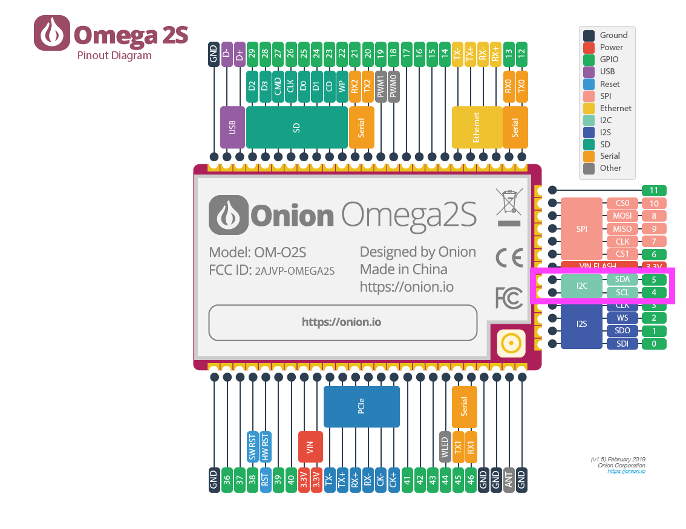

# I2C

**I2C** (Inter-Integrated Circuit), sometimes called Two-Wire Interface, is a serial interface used to quickly and easily connect multiple devices to controllers and processors such as the Omega2. Examples of I2C devices include:

* Sensors, such as temperature, humidity, current
* Actuators, such as buzzers, lights
* Controllers, such as motors, relays

The Omega2 features one hardware I2C bus that acts in host-mode.

## Context: How does I2C work? 

Communication is performed over 2 data lanes, each given their own pin on the Omega2:
- Clock (SCL) - Signals when data is being transferred
- Data (SDA) - Carries the data to be transferred

The I2C bus uses a **host-client** architecture:
- Many clients on an I2C bus
- Bus **hosts** are devices that are in control of when and to whom they send and receive data
    - hosts send commands which include the address of the client who should receive it
    - When using I2C with the Omega2, the Omega2 is configured to be the only bus host
- Bus **clients** are devices that respond to hosts when they receive a command **addressed to them**.
    - Each client is identified with a hexadecimal address (eg. 0x27)
    - Clients will safely ignore commands not addressed to them

Hosts and clients operate in either of two modes:
- **transmit** - sending data
- **receive** - receiving data

## Hardware

The Omega2 features a hardware I2C controller:
- Logic level is 3.3V
- Can operate in host-mode only
- By default operates in standard mode (100kbps)
    - Fast mode (400kbps) is also supported

### I2C Pins

The I2C pins (SCL and SDA) on the Omega2 and Omega2S are highlighted below.

import Tabs from '@theme/Tabs';
import TabItem from '@theme/TabItem';

<Tabs>
  <TabItem value="omega2" label="Omega2" default>


  </TabItem>
  <TabItem value="omega2s" label="Omega2S">



  </TabItem>
</Tabs>

## Software: Controlling I2C Devices

The I2C bus interface is available at `/dev/i2c-0`

> The `/dev/i2c-0` is a virtual device file. This is provided by `sysfs`, a pseudo-file system that holds information about the Omega’s hardware in files, and lets the user control the hardware by editing the files.

### On the Command Line

For basic testing and I2C access on the command line, it is recommended to use the `i2c-tools` command line utilities.

To install the package:

```
opkg update
opkg install i2c-tools
```

See the [i2c-tools documentation](https://linuxhint.com/i2c-linux-utilities/) to learn how to use the individual commands.


### Using C or C++

To interact with I2C devices in C or C++, it is recommended to use the `/dev/i2c-0` adapter directly.

See the documentation for using the I2C device adapter in user-space for more information: https://www.kernel.org/doc/Documentation/i2c/dev-interface

### Using Python

The `python3-smbus` module is the recommended way to interact with I2C devices in Python.

To install the Python module:

```
opkg update
opkg install python3-smbus 
```

To learn how to use the module, see the documentation for an equivalent Python module here: https://pypi.org/project/smbus2/

:::tip
In the linked documentation, the `from smbus2 import SMBus` import statement is used. 

Omega2 users must instead use `from smbus import SMBus`
:::

##  More Resources 

- Default I2C bus clock speed and how it can be changed: https://community.onion.io/topic/4332/faq-what-is-the-default-i2c-bus-clock-speed-can-i-change-it-to-400khz
<!-- TODO: need to check with Jaymin if the below is still possible on OpenWRT 22 or 23 -->
<!-- - Setting up a software-based (bit-bang) I2C bus: https://community.onion.io/topic/4333/faq-how-can-i-make-a-software-based-bit-bang-i2c-bus-can-i-use-any-2-gpios-as-an-i2c-bus -->


#

import { GiscusDocComment } from '/src/components/GiscusComment';

<GiscusDocComment />