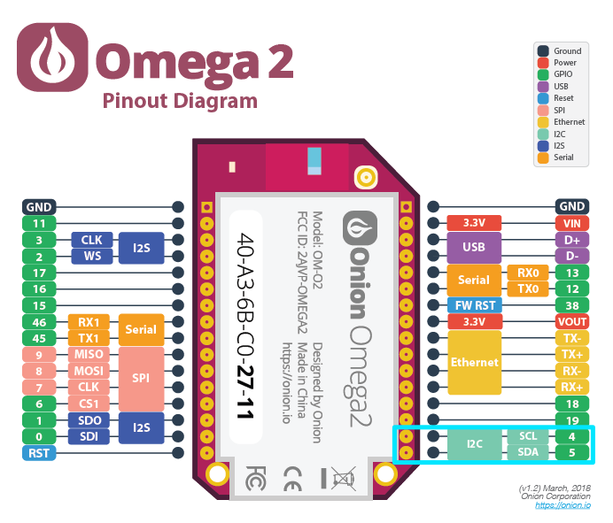

import Tabs from '@theme/Tabs';
import TabItem from '@theme/TabItem';

# I2C

## Introduction
The **Inter-Integrated Circuit (I2C)**, sometimes called the Two-Wire Interface, is a serial interface used to connect multiple devices quickly and easily to controllers and processors such as the Omega2. 

Some examples of I2C devices include:
- Sensors, such as temperature, humidity, and current.
- Actuators, such as buzzers and lights.
- Controllers, such as motors and relays.

The Omega2 has one hardware I2C bus.

## Context
Communication with the I2C is performed over 2 data lanes, each given their own pin on the Omega2:
- Clock (SCL) – Signals when data is being transferred.
- Data (SDA) – Carries the data to be transferred.

The I2C bus uses a **master-worker** architecture:
- There are many workers on an I2C bus.
- Bus **masters** are devices that are in control of when and to whom they send and receive data.
	- Masters send commands which include the address of the worker who should receive it.
	- When using I2C with the Omega2, the Omega2 is configured to be the only bus master.
- Bus **workers** are devices that respond to masters when they receive a command addressed to them.
	- Each worker is identified with a hexadecimal address (e.g. `0x27`).
	- Workers will safely ignore commands not addressed to them.
- Masters and workers operate in either of two modes:
	- **Transmit** – sending data.
	- **Receive** – receiving data.

## Hardware
The Omega2 uses a hardware-based I2C controller:
- The logic level is 3.3V.
- Can operate in host-mode only.
- Has two baud rates.
	- Standard mode - 100kbps (default)
	- Fast mode - 400kbps (also supported)

<Tabs>
	<TabItem value="omega2" label="Omega2" default>
	The I2C pins are highlighted on the Omega2 diagram below.


	</TabItem>
	<TabItem value="omega2s" label="Omega2S">
	The I2C pins are highlighted on the Omega2S diagram below.
	

	</TabItem>
</Tabs>

## Software
The Omega2 I2C bus interface is available at `/dev/i2c-0`.

### Interacting with the I2C bus
The following features are available on the I2C bus.

#### Command line
Use the i2c-tools command line program to communicate with any connected I2C device.

:::tip

The command line tools are useful for basic testing of I2C devices with your Omega2.

:::

**Installation instructions:**

To use the command line tools you’ll first need to update your packages and install the i2c-tools using Omega’s package manager `opkg`.

To update your list of packages:
```
opkg update
```

Next, you’ll install the i2c-tools package:
```
opkg install i2c-tools
```

Now you’re ready to work with the command line tools.

**Usage instructions:**

For more information on how to use the command line tools, see [https://linuxhint.com/i2c-linux-utilities/](https://git.kernel.org/pub/scm/utils/i2c-tools/i2c-tools.git/tree/).

#### C/C++
Onion recommends using the `libi2c` library when programming with C/C++.

For more information on how to use the library, see the source code at: [https://git.kernel.org/pub/scm/utils/i2c-tools/i2c-tools.git/tree/](https://git.kernel.org/pub/scm/utils/i2c-tools/i2c-tools.git/tree/).

#### Python
Onion recommends using the `python3-smbus` module when programming with Python. 

**Installation instructions:**

If you haven’t already done so, you’ll need to update your list of packages using Omega’s package manager `opkg`.

To update your list of packages:
```
opkg update
```

Next, you’ll install the `pthon3-smbus` module:
```
opkg install python3-smbus
```

And now you’re all set to use `python3-smbus` in your programs.

**Usage instructions:**

For more information on how to use the `python3-smbus` module, see the source code at: [https://git.kernel.org/pub/scm/utils/i2c-tools/i2c-tools.git/tree/py-smbus/smbusmodule.c](https://git.kernel.org/pub/scm/utils/i2c-tools/i2c-tools.git/tree/py-smbus/smbusmodule.c) .

:::tip

In the linked documentation, the from`smbus2` `import` SMBus import statement is used. Omega2 users must instead use from`smbus` `import` in their SMBus import statement.

:::

## Additional resources
- Default I2C bus clock speed and how it can be changed: [https://community.onion.io/topic/4332/faq-what-is-the-default-i2c-bus-clock-speed-can-i-change-it-to-400khz](https://community.onion.io/topic/4332/faq-what-is-the-default-i2c-bus-clock-speed-can-i-change-it-to-400khz) 

<!-- 
- Setting up software-based (bit-bang) I2C bus: [https://community.onion.io/topic/4333/faq-how-can-i-make-a-software-based-bit-bang-i2c-bus-can-i-use-any-2-gpios-as-an-i2c-bus](https://community.onion.io/topic/4333/faq-how-can-i-make-a-software-based-bit-bang-i2c-bus-can-i-use-any-2-gpios-as-an-i2c-bus) –>

