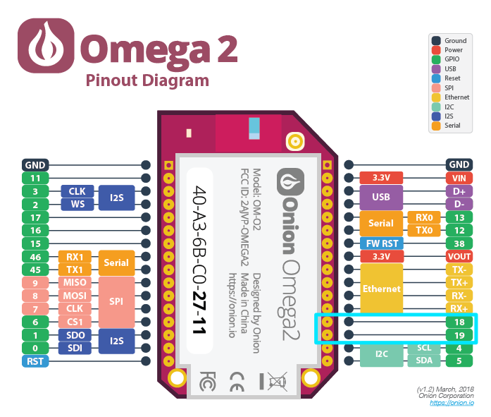
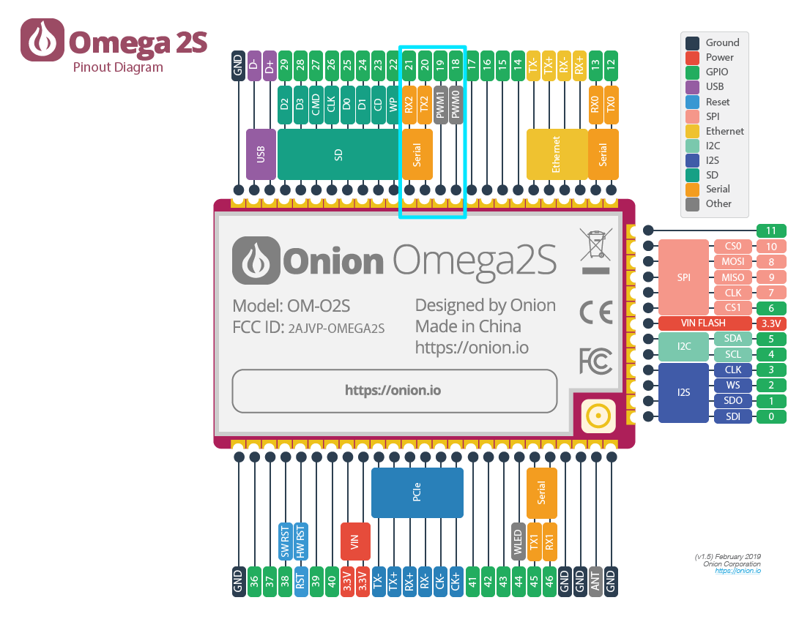

import Tabs from '@theme/Tabs';
import TabItem from '@theme/TabItem';
import { GiscusDocComment } from '/src/components/GiscusComment';

## Introduction

The Omega's SoC has several PWM modules. The Omega2 exposes 2 hardware PWM channels on its pin headers while the Omega2S exposes 4.

## Context

Pulse-width modulation (PWM) is a technique of producing varying analog signals from a digital source.

- Duty cycle = percentage of time the signal is high (0-100).
- Frequency = signal frequency.

## Hardware

In this section we are referring to hardware-based PWM modules.

**Omega2/2+:** 2 channels, **Omega2S/2S+:** 4 channels

The hardware PWM modules have a frequency range of 39Hz to 40MHz. For lower frequencies it is recommended to consider an external hardware PWM generator or the use of a software generated PWM signal from a GPIO pin.

| PWM Channel | GPIO   | Notes        |
| :---------- | :----- | :----------- |
| 0           | GPIO18 |              |
| 1           | GPIO19 |              |
| 2           | GPIO20 | Omega2S only |
| 3           | GPIO21 | Omega2S only |

The PWM pins are highlighted on the Omega2/2S diagrams below.

<Tabs>
  <TabItem value="omega2" label="Omega2" default>



  </TabItem>
  <TabItem value="omega2s" label="Omega2S">



  </TabItem>
</Tabs>

## Software

The following sections discuss enabling and working with the hardware PWM.

### Enabling Hardware PWM

To enable the use of hardware PWM, a kernel module needs to be installed:

```shell
opkg update   
opkg install kmod-pwm-mediatek-ramips
```

### Adjusting pin multiplexing to enable PWM pins

The Omega's pins are multiplexed allowing the exposed pins to be used for several different functions.

The pin multiplexing configuration can be easily changed from the command line using `omega2-ctrl`.

For GPIO18:

```shell
omega2-ctrl gpiomux set pwm0 pwm
```

For GPIO19:

```shell
omega2-ctrl gpiomux set pwm1 pwm
```

For GPIO20 (Omega2S only):

```shell
omega2-ctrl gpiomux set uart2 pwm23
```

For GPIO21 (Omega2S only):

```shell
omega2-ctrl gpiomux set uart2 pwm23
```

:::info

The multiplexing configuration will need to be repeated after each reboot of the Omega2.

:::

### Generating PWM signals

To generate PWM signals, we'll need to install the `omega2-script` package.

```shell
opkg update
opkg install omega2-script
```

Once the pins have been configured for PWM usage, we can configure the PWM hardware module to generate a PWM signal using the following command:

```shell
onion pwm <CHANNEL> <DUTY CYCLE> <FREQUENCY>
```

Where:

- CHANNEL is 0 (GPIO18), 1 (GPIO19), 2 (GPIO20), or 3 (GPIO21).
  - Remember that channels 2 & 3 are exposed on the Omega2S only.
- DUTY_CYCLE is the percentage of time the signal is `ON`, expressed 0-100
- FREQUENCY is the signal frequency, expressed in Hz.

#### Stopping the PWM signal

To stop and disable the PWM signal:

```shell
onion pwm <CHANNEL> disable
```

:::note

The `omega2-script` provides a helpful wrapper around `sysfs` for PWM. The source code is available at: https://github.com/OnionIoT/OpenWRT-Packages/blob/openwrt-23.05/omega2-base/files/usr/lib/onion-pwm-lib.sh

<!-- TODO: update above with OPENWRT_VERSION variable -->

:::

<GiscusDocComment />