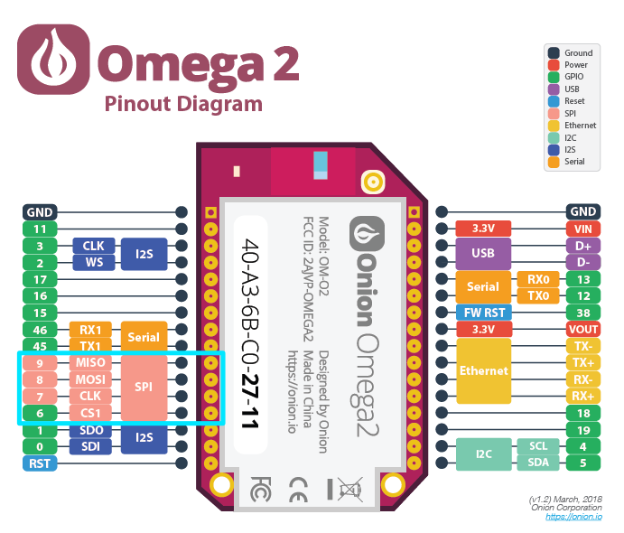
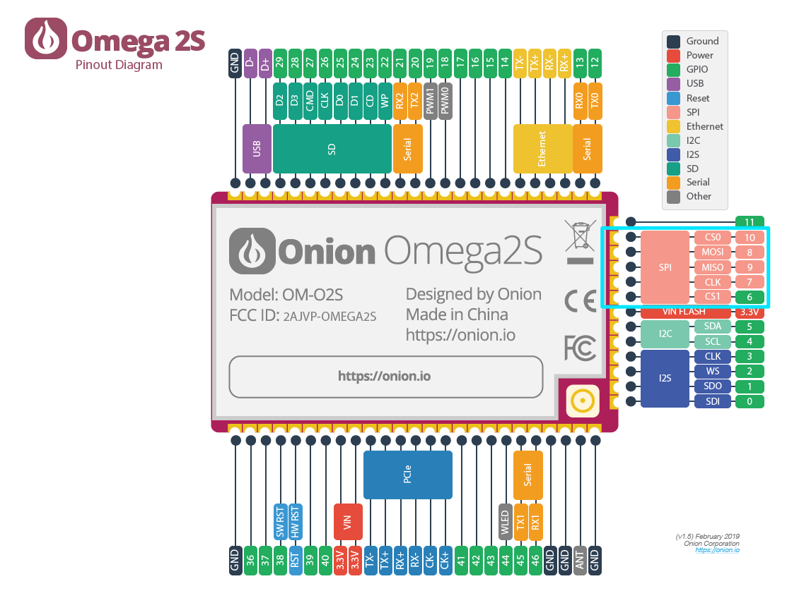

import Tabs from '@theme/Tabs';
import TabItem from '@theme/TabItem';
import { GiscusDocComment } from '/src/components/GiscusComment';

## Introduction

The Omega2 has a built-in hardware SPI controller allowing it to communicate with SPI-enabled peripherals. It offers 2 Chip Selects. However, the internal flash storage uses Chip Select 0, so only Chip Select 1 is free for external devices.

## Context

The **Serial Peripheral Interface (SPI)** is a four-wire synchronous communication protocol, largely used to connect microprocessors or microcontrollers to sensors, memory, and other peripherals.

| SPI Signal | Meaning                                                       |
| :--------- | :------------------------------------------------------------ |
| SCK        | System Clock                                                  |
| MOSI       | Master Out, Slave In – Data sent from the Master to the Slave |
| MISO       | Master In, Slave Out – Data sent from the Slave to the Master |
| CS/SS      | Chip Select/Slave Select                                      |

SPI is a **synchronous** data bus, meaning that one of the lines is a clock, used to synchronize the bits being sent on the data lines.

The protocol is based on the **Master-Worker** architecture. 

- The Master will generate the System Clock and the Chip Select signals.
- Each worker requires its own Chip Select connection to the Master.

## Hardware

The Omega2 has one hardware SPI interface available:

- The interface supports half-duplex transmissions and can operate in host-mode only.
- The maximum SPI clock frequency is 40 MHz.
- The flash storage occupies SPI Chip Select 0 and cannot be used; external devices can be connected to SPI Chip Select 1.
- External devices connected to the SPI bus can affect the boot sequence under certain conditions. (Refer to [special pins - SPI pins](https://documentation.onioniot.com/hardware-interfaces/special-pins#spi-pins) for details.)

:::warning

The Omega2 does not support full-duplex SPI transmissions. This is due to a hardware bug in the underlying MT7688 SoC used in the Omega2.

For use cases where full-duplex SPI is a requirement, consider using a [software-based SPI bus](#software-based-spi-bus).

:::

The SPI and CS1 pins are highlighted on the Omega2/2S diagrams below.

<Tabs>
  <TabItem value="omega2" label="Omega2" default>

  </TabItem>
  <TabItem value="omega2s" label="Omega2S">

  </TabItem>
</Tabs>

### Software-Based SPI Bus

In addition to the built-in hardware SPI bus, the Omega2 also supports **software-based SPI bus implementations**. This allows users to create additional SPI buses or use non-standard GPIOs for SPI communication, which is useful when:

- More than one SPI device needs to be connected
- Specific GPIOs need to be used for SPI communication
- Full-duplex SPI transactions are required (not supported on the Omega2’s hardware SPI bus)

#### How Software SPI Works
Unlike hardware SPI, which uses a dedicated controller to handle communication, software SPI "bit-bangs" GPIOs (manually toggling them on and off in software). This approach provides flexibility but is significantly slower and increases CPU load:

| Feature                 | Hardware SPI (CS1)                     | Software SPI |
|-------------------------|--------------------------------------|--------------|
| **Speed**               | Up to **40MHz** (fast)               | Up to **1.4MHz** - Slower, best for low-data applications |
| **Full-Duplex Support** | ❌ No on Omega2                                | ✅ Yes |
| **SPI Configuration**   | Limited; CS0 is reserved for flash | Flexible; can be configured as needed |
| **GPIO Flexibility**    | Fixed to SPI pins                   | Any GPIOs can be used |
| **System Load**         | Low (uses dedicated SPI controller) | Higher (CPU handles SPI signals) |

#### Enabling a Software SPI Bus
A software SPI bus can be enabled on the Omega2 by installing a **Device Tree Overlay** package. This allows developers to define which GPIOs should function as SPI signals when creating the Device Tree Overlay package.

For installation instructions and configuration details, see the [Software SPI Bus article in the Device Tree Overlay chapter](/device-tree-overlay/software-spi).

## Software

The Omega2 hardware SPI interface is available at `/dev/spidev0.1`.

- `spidev0` is the Omega2's SPI bus number.
- 1 indicates the device ID, which corresponds to the worker connected to the Omega2's CS1 pin.

### Interacting with the SPI bus

The following features are available on the SPI bus.

#### Python

Onion recommends using the `python3-spidev` Python module for SPI communication.

The `python3-spidev` module provides a series of functions that implement SPI communication through the Linux device interface. It also provides an Omega2-specific `xfer3` function that implements a half-duplex write-then-read SPI transmission.

For installation and usage instructions see: [https://github.com/OnionIoT/python-spidev#python-spidev](https://github.com/OnionIoT/python-spidev#python-spidev).

<GiscusDocComment />