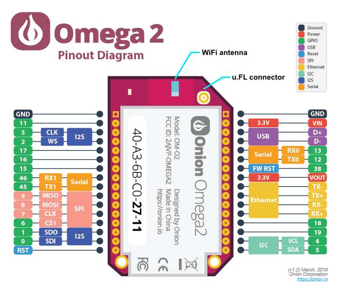
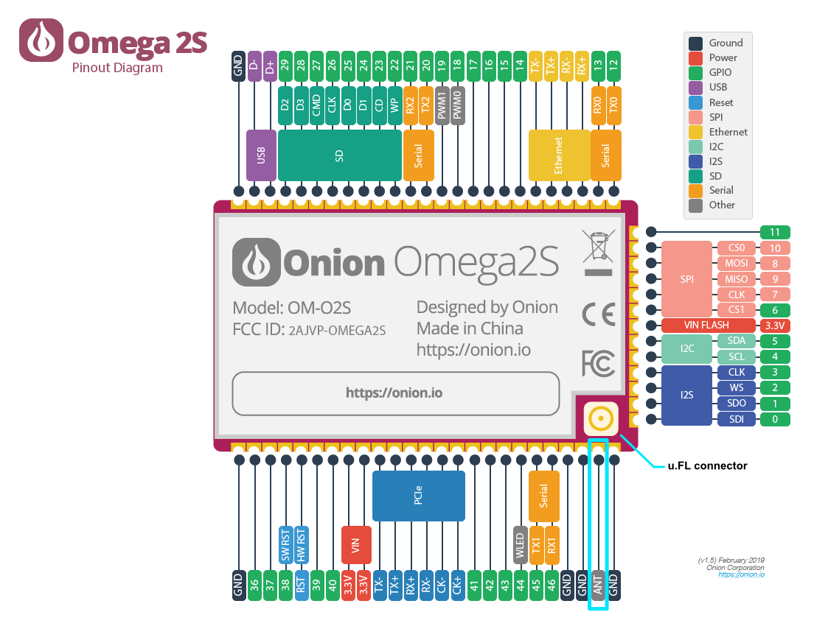

import Tabs from '@theme/Tabs';
import TabItem from '@theme/TabItem';

# WiFi Antenna & u.FL connector

## Introduction
The Omega2 has a built-in 2.4 GHz IEEE 802.11 b/g/n WiFi radio that requires an antenna. 

## Hardware
The Omega2/2+ has an on-board ceramic surface-mount 2dBi directional chip antenna. It can also be connected to an external antenna using the on-board u.FL connector.

The Omega2S/2S+ has a u.FL connector and an antenna (ANT) pin to connect to an external antenna, but does not have a built-in antenna.  

External antennas can directly connect to the u.FL connector on the module. However, on-board antennas like ceramic chip or PCB trace antennas need to connect to the ANT pin.

### U.FL connector
Connect an external antenna to the Omega’s male surface-mounted u.FL connector. An external antenna will extend the range of the WiFi connection by using high gain antennas or directional Yagi antennas. When using an external u.FL antenna along with an SMT antenna, the SMT and external antenna will split the transmission power, providing only half of the expected gain. 

The Omega2/2+ requires a modification to maximize the performance with an external antenna. Remove the 0Ω resistor located between the SMT WiFi antenna and u.FL connector so the SMT antenna is disconnected and all the power goes to the external u.FL antenna.

Follow the procedure outlined [here](https://onion.io/2bt-u-fl-antennas-with-the-omega/) to modify your Omega.

:::note DISCLAIMER

Make any device changes carefully and at your own risk. These changes are hard to undo and will require permanent use of an external antenna for reasonable WiFi connectivity. If you damage your Omega during modifications, Onion Corporation is not responsible.

:::

The Omega2S/Omega2S+ require no modification. When designing a custom board for the Omega2S/Omega2S+, you must choose between connecting the antenna to the ANT pin and the u.FL connector.

<Tabs>
  <TabItem value="omega2" label="Omega2" default>
  
  The WiFi antenna pin and u.FL connector are highlighted on the Omega2 diagram below.

:::note

On the Omega2, use either the on-board chip antenna or the u.FL connector in a design. If both an antenna and a u.FL connector are used, the transmission power is divided between them.

:::

  </TabItem>
  <TabItem value="omega2s" label="Omega2S">
  
  The u.FL connector and ANT pin are highlighted on the Omega2S diagram below.

:::note

On the Omega2S, choose the ANT pin or the u.FL connector. If both the ANT pin and the u.FL connector are connected to antenna, the transmission power is divided between them.

:::

  </TabItem>
</Tabs>

## Software
The open-source mt76 driver is used for WiFi networking.

The Omega2 WiFi radio supports:

- Hosting an access point (AP).
- Connecting to an existing wireless network (STA).
- Hosting an access point and connecting to an existing wireless network simultaneously (AP+STA).

For further information on the Omega2 and wireless networking, see the [wireless networking article](https://documentation.onioniot.com/networking/wifi).

