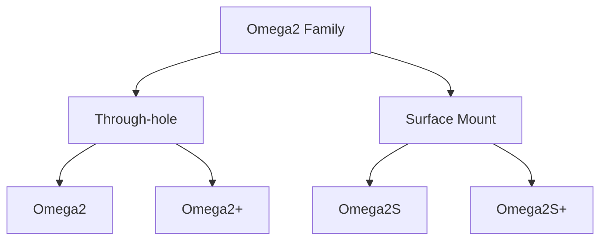

# Onion Omega2 & Omega2S Documentation

Documentation for the **new beta firmware based on OpenWRT 22.03** for the Onion Omega2 IoT Computer family.

:::danger

If you're unsure about using beta firmware, do not proceed and stick with the stable firmware

:::

:::caution

If you're looking for documentation for the stable v0.3.3 and v0.3.4 firmware, see https://docs.onion.io

:::

## Variants

There are 4 variants of the Omega2 modules:

