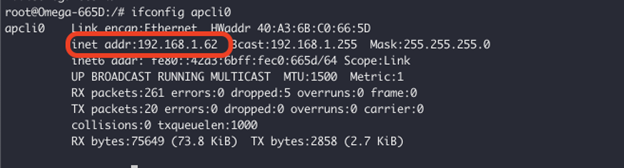

import { GiscusDocComment } from '/src/components/GiscusComment';

Every device on a network is assigned a unique identifier called an IP address. An IPv4 address consists of four numbers ranging from 0 to 255, separated by periods — for example, `192.168.0.100`.


Knowing the Omega's IP address is required for accessing it over the local network. This includes:
- Accessing the command-line through SSH
- Accessing a web server hosted on the Omega
- Transferring files to and from the Omega using protocols like SCP, FTP, and rsync

## Procedure to Determine the IP Address

This procedure relies on the `ifconfig` utility to find the Omega's IP address. The `ifconfig` utility is a common Linux utility for monitoring network interfaces and is installed on the Omega by default.

First, determine which network interface to check, and then use `ifconfig` to find the IP address. 

:::info Note

To run the `ifconfig` command, access to the Omega's command line is required. To connect to the command line either:
- Use a serial connection: see the [quickstart guide](../quickstart/serial-command-line) for details
- Connect via the WiFi AP: Connect to the Omega's default WiFi Access Point and SSH into 192.168.3.1, which is the Omega's default IP address on its AP.

:::

### Step 1: Determine the Relevant Network Interface

The Omega has several network interfaces. The interface that should be checked depends on how the Omega is connected to the network:

* Use `apcli0` for connections to an existing WiFi network as a client
* Use `eth0` for Ethernet connections
* Use `ra0` for the Omega's WiFi Access Point

:::note Note

The Omega's IP address on its own WiFi Access Point is set in the network configuration in `/etc/config/network`. It is not assigned by an external DHCP server.

:::

### Step 2: Run the `ifconfig` Command

To find the IP address of the Omega on a specific interface, run the following command:

```shell
ifconfig <interface-name>
```

**When connected to an existing WiFi network:**

```shell
ifconfig apcli0
```

**When connected via Ethernet to a network:**

```shell
ifconfig eth0
```

**When connected to the Omega's own WiFi Access Point:**

```shell
ifconfig ra0
```

### Step 3: Locate the IP Address

The IP address will be in the output of the `ifconfig` command, among other information:



Look for the line containing `inet addr:`. **This line shows the Omega's IP address on that network interface.**

If that line is blank, the Omega does not have an IP address on that network interface. Double check the network configuration and try again.


<!-- TODO: review if `hostname -I` is an alternate method of finding the ip address -->


<GiscusDocComment />