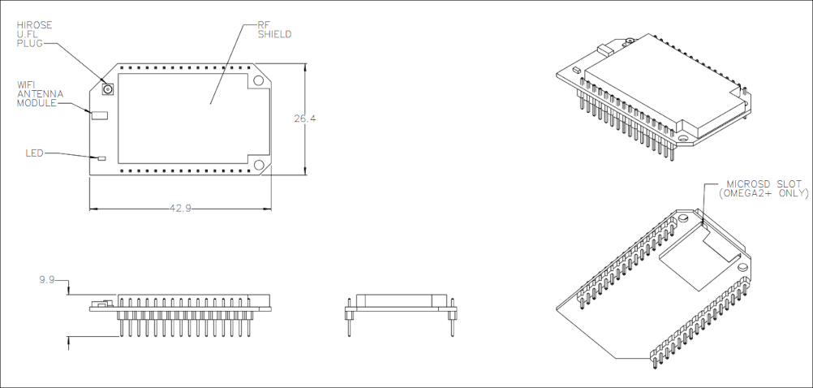
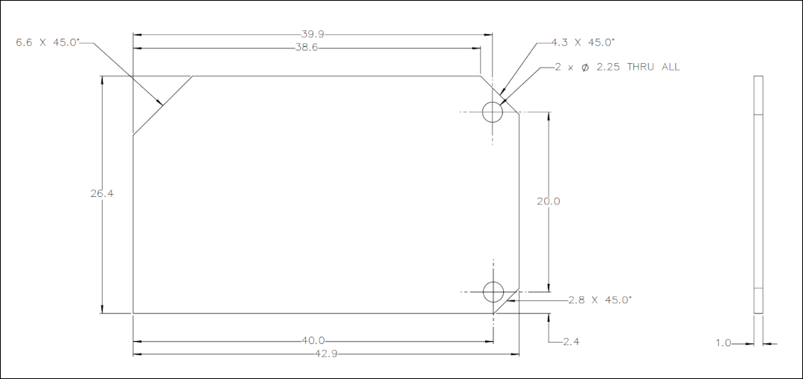
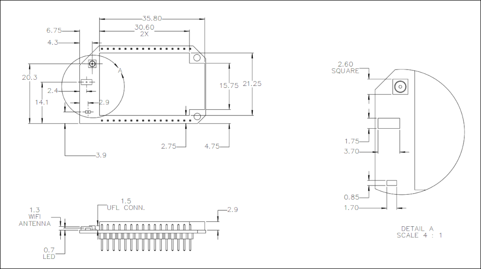
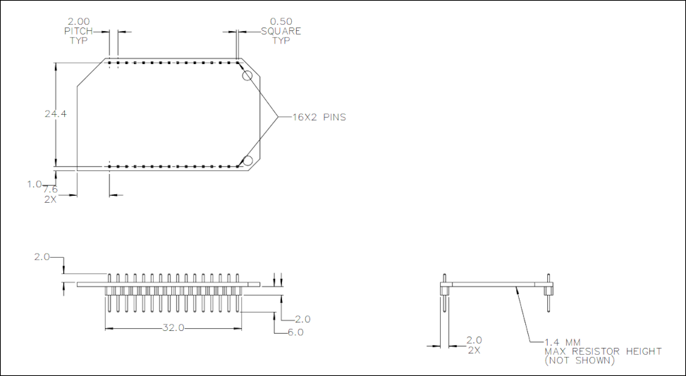
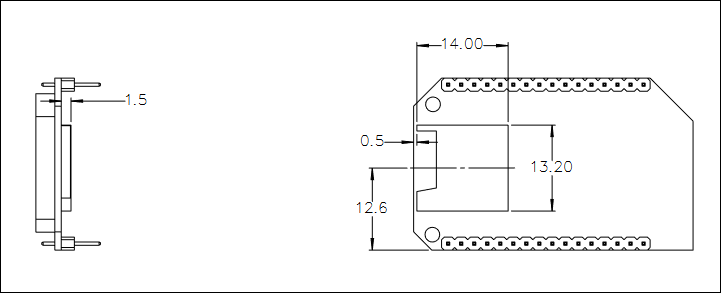

import { GiscusDocComment } from '/src/components/GiscusComment';

The following drawings provide an overview and details of the Omega2/2+ dimensions and geometry. All dimensions unless otherwise noted are in mm.

Mechanical overview

Board detail

Component detail

Pin detail

SD slot detail - Omega2+ only

<GiscusDocComment />
