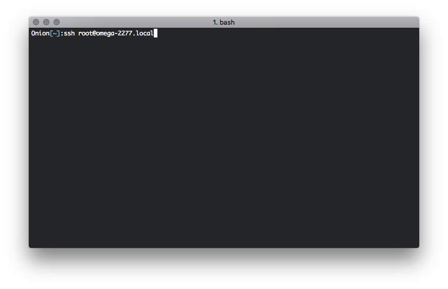
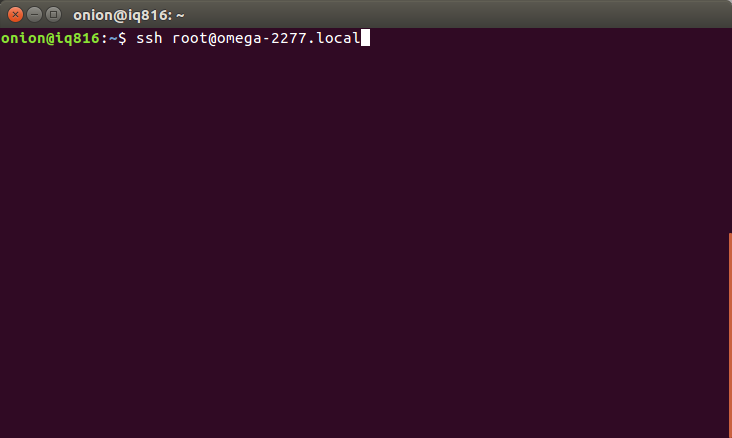
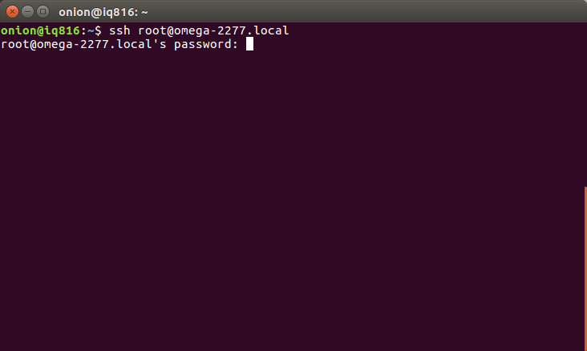
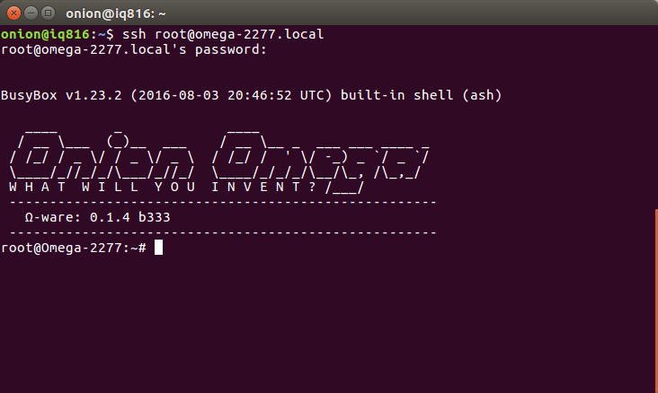
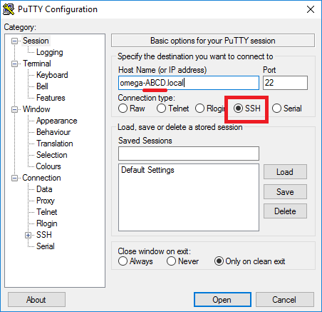

import { GiscusDocComment } from '/src/components/GiscusComment';
import Tabs from '@theme/Tabs';
import TabItem from '@theme/TabItem';

:::tip

This article is not a required part of the Quickstart, but illustrates the procedure of connecting to the Omega using SSH.

:::

Connecting to your Omega2 over **SSH (Secure Shell)** lets you interact with the device’s Linux command line from any computer on the same network. No USB-to-serial hardware required.

## Before You Start

SSH creates an encrypted command-line session between two computers: your PC (the *client*) and the Omega (the *server*).  
Make sure **both devices are on the same LAN segment**—either through the same Wi-Fi access point, Ethernet switch, or the Omega’s own AP mode.

### Pros & Cons

**Pros**

- Works wirelessly—nothing to plug in once the Omega is powered and connected to the same network.
- Multiple simultaneous sessions are possible.  
- Supports file transfers with SCP/SFTP.

**Cons**

- If the network drops, your SSH session ends immediately.  
- Requires the Omega’s IP address or hostname.

### Finding the Omega’s IP Address

Follow the steps in the [Find the Omega’s IP Address](/networking/find-ip-address) guide.

### Finding the Omega’s Hostname

Every Omega advertises a unique hostname in the form `omega-XXXX.local`, where **XXXX** are the last four characters of its MAC address.  
You can find the MAC on the module’s label or by running `ifconfig` from a serial console.

## Procedure

You will need:

- An **Omega2** that is powered on and connected to the network.  
- The Omega's [**IP address**](#finding-the-omegas-ip-address) or [**hostname**](#finding-the-omegas-hostname)
- The default login credentials: 
  - **username:** `root`
  - **password:** `onioneer`
- A host computer to use to connect to the Omega

Select the host computer operating system below for the relevant instructions:

<Tabs>
  <TabItem value="mac" label="macOS" default>

#### Step 1: Open Terminal

Open the **Terminal** application found in **Applications → Utilities**.

#### Step 2: Connect over SSH

Run the following command:

```bash
ssh root@HOST
```

Replace `HOST` with the Omega’s hostname (`omega-XXXX.local`) or its IP address.  



#### Step 3: Enter Password

When prompted, enter the password.<br/>
By default, the password is: `onioneer`


import KnownHostsPrompt from './_ssh_known_hosts_prompt.mdx';

<KnownHostsPrompt/>

#### Step 4: Verify connection

The Omega terminal will show the welcome banner:


  </TabItem>

  <TabItem value="linux" label="Linux">

#### Step 1: Open a Terminal

Launch your preferred terminal emulator (e.g. **GNOME Terminal**, **Konsole**, **xterm**).

#### Step 2: Connect over SSH

Run the following command:

```bash
ssh root@HOST
```

Replace `HOST` with the Omega’s hostname (`omega-XXXX.local`) or its IP address.  



#### Step 3: Enter Password

When prompted, enter the password.<br/>
By default, the password is: `onioneer`



<KnownHostsPrompt/>

#### Step 4: Verify connection

The Omega terminal will show the welcome banner:



  </TabItem>

  <TabItem value="win-powershell" label="Windows PowerShell">

#### Step 1: Open PowerShell

Open **PowerShell** (Windows 10/11 include OpenSSH by default).

#### Step 2: Connect over SSH

Run the following command:

```powershell
ssh root@HOST
```

Replace `HOST` with the Omega’s hostname or IP.  

#### Step 3: Enter Password

When prompted, enter the password.<br/>
By default, the password is: `onioneer`

> If a security prompt warns about a new host key, type `yes` and press **Enter**.

#### Step 4: Verify the Connection

The Omega shell appears:

```text
root@Omega-XXXX:~#
```


  </TabItem>

  <TabItem value="win-putty" label="Windows PuTTY">

#### Step 1: Install PuTTY

Go to http://www.putty.org/ and download the Windows installer specific to your machine.

#### Step 2: Open PuTTY

Launch **PuTTY.exe**

#### Step 3: Configure and Connect

Configure an SSH connection

1. In **Session → Host Name**, enter the Omega’s hostname (`omega-XXXX.local`) or its IP address
2. Ensure **Port** is `22` and **Connection type** is **SSH**.  
3. Click **Open** and accept the security alert when prompted.



#### Step 4: Credentials

Click Open and enter the credentials when prompted.

By default, the credentials are:<br/>
Username: `root` <br/>
Password: `onioneer`

#### Step 5: Verify the connection

The Omega shell appears:

```text
root@Omega-XXXX:~#
```

  </TabItem>
</Tabs>


<GiscusDocComment />
