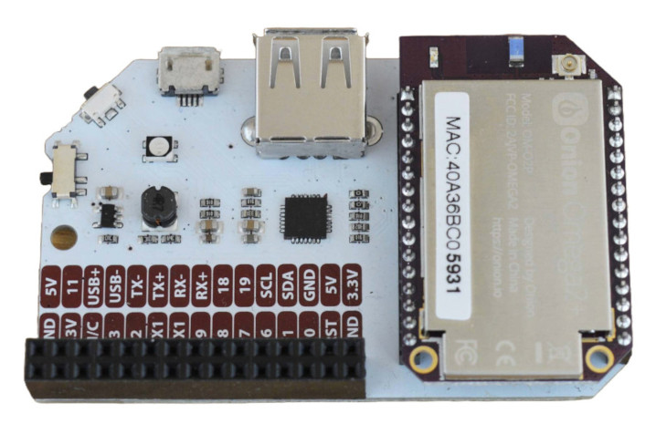

import { GiscusDocComment } from '/src/components/GiscusComment';

<!-- NOTE: Ok to keep OpenWRT release numbers hard-coded in this article -->

## Introduction

This article covers the quickest way for you to get up and running with your new Omega2 device. It applies to the Omega2 updated firmware, which is based on OpenWRT 23.05, 22.03, and later.

### Upgrading firmware from v0.3.4

For devices running the Omega2 firmware v0.3.4, please see the instructions found in the [Installing the New Firmware](/firmware/installing-firmware) article and then return to this article.

To get started with a device running the v0.3.4 firmware, please see the first time setup article in our legacy documentation: [https://docs.onion.io/omega2-docs/first-time-setup.html](https://docs.onion.io/omega2-docs/first-time-setup.html). **Note the legacy first time setup will not work with the new firmware!**

If you're unsure how to tell the difference between the "New" firmware and the previous v0.3.4 firmware, see the [article on identifying the firmware version](../introduction/determine-fw-version).

### Recommended hardware

Onion recommends the following hardware setup for ease of use:

#### For Omega2/2+

- Omega2 or Omega2+ device
- Expansion dock

#### For Omega2S/2S+

- Omega2S Development Kit. Please see the getting started guide on our GitHub site: [https://github.com/OnionIoT/Omega2/blob/master/Documents/Omega2S%20Dev%20Kit%20-%20Getting%20Started.pdf](https://github.com/OnionIoT/Omega2/blob/master/Documents/Omega2S%20Dev%20Kit%20-%20Getting%20Started.pdf)

#### Additional required materials

You'll need a computer and a microUSB to USB cable in addition to the Omega2 hardware.

#### Overview of the process

In this first article, we cover the unboxing and powering up of your Omega2. Then we’ll cover connecting to Omega2’s command line and WiFi in separate articles within the QuickStart section.

1. Unbox your Omega2 and connect to your computer.
1. Connect to the command line over the USB serial connection.
1. Connect to WiFi.

## Unbox and hardware setup

This section assumes you have an Omega2 device and an Expansion dock. If you didn't purchase an Expansion dock, see our guide on [powering the Omega without a dock](https://docs.onion.io/omega2-docs/hardware-prep-no-dock.html#hardware-prep-no-dock).

### Unpack the device

Unpack your Omega2 and Expansion Dock from their boxes.

### Connect the device

Plug your Omega2 into the socket on the Expansion Dock, making sure the Omega2’s pins are securely seated in the socket.

### Connect the dock to a computer

Plug the microUSB cable into your Omega2 and connect the other end to the USB port on your computer. This provides power to the Omega2 as well as a connection with Omega2’s command line utility.

All Omega Docks have voltage regulators so the USB port can power the Omega2 with the required 3.3Vdc.

### Power on

Turn on your Omega2 using the switch.

### Wait until it boots

The amber LED on your Omega2 should turn on and start blinking after about 10 seconds. The LED will stop blinking and remain solid after about a couple of minutes. This means your Omega2 has completed its boot sequence.

Congratulations, your Omega2 is now powered up and you're ready to further explore your device.

:::note

If the amber LED on your Omega2 turns on and stays on, wait for a minute to allow your Omega2 to complete its boot.

:::

<GiscusDocComment />
