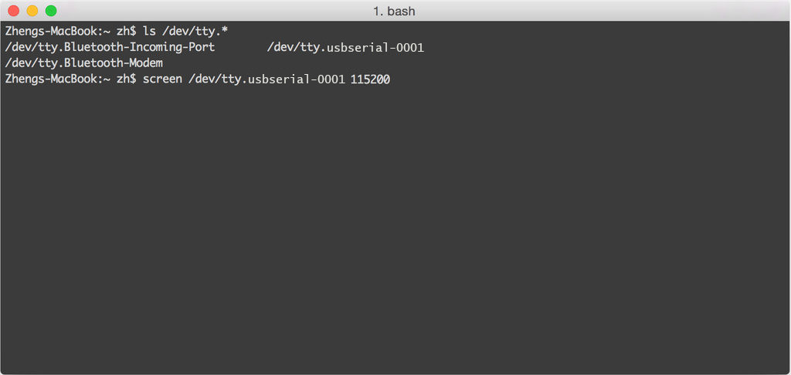
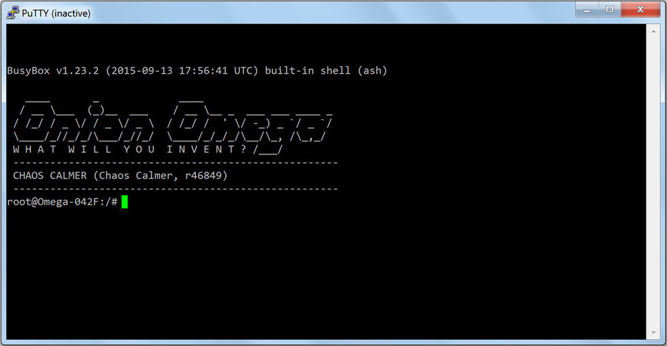

import Tabs from '@theme/Tabs';
import TabItem from '@theme/TabItem';
import { GiscusDocComment } from '/src/components/GiscusComment';

## Context

The Serial Command Line terminal interface is for debugging during early development. The serial command line is always accessible if the device is on. There is no need to rely on a network connection, like there is with SSH connections. For stable projects, SSH should be used to access the command line.

The Omega2’s Serial Command Line interface is accessed with a USB cable connected to your computer. This will be the case if you are using an Omega2/2+ on an Expansion Dock, Mini Dock, or an Omega2S/2S+ with a Development Kit.

The Omega2 uses its UART pins to run a terminal and the Expansion Dock USB-to-Serial chip translates the serial terminal signals into USB signals that your computer can understand and vice versa.

Note that the Expansion and Mini docks are the only docks that have USB-to-Serial chips, so the serial terminal only works with these docks.

Omega2's command line is accessible on UART0.

## Install USB-to-Serial driver on your computer

You'll need to download and install the Serial-to-USB driver on your computer for your specific operating system.

<Tabs>
 <TabItem value="Mac OS" label="Mac OS Driver" default>

Download and install the [Silicon Labs CP2102 driver](https://www.silabs.com/Support%20Documents/Software/Mac_OSX_VCP_Driver.zip) for OS X.

 </TabItem>
 <TabItem value="Windows" label="Windows Driver" default>

Download and install the [Silicon Labs CP2102 driver](https://www.silabs.com/Support%20Documents/Software/CP210x_VCP_Windows.zip) for Windows.

 </TabItem>
 <TabItem value="Linux" label="Linux Driver" default>

Many modern Linux distributions include the CP210x driver by default, so there is no need to install it.

**Details:** The CP210x driver is included on any Linux OS running kernel v2.6 and later ([reference](https://community.silabs.com/s/article/are-cp210x-devices-supported-in-my-version-of-linux-x?language=en_US)).

Run `sudo 1smod` to see a list of installed modules. If it is supported, CP210x should be on this list.

You may need to run `sudo modpobe cp210x` to load the driver.

### Specific Linux distributions

- Included in Ubuntu since version 20.10 ([reference](https://community.silabs.com/s/question/0D51M00007xeTTESA2/cp210x-installing-on-ubuntu-2010?language=en_US)).
- Included in Debian ([reference](https://unix.stackexchange.com/questions/754357/cp210x-driver-on-debian)).

To make the device accessible to the user you'll need to run a few additional commands:

```shell
sudo usermod -a-G dialout $USER
sudo usermod -a-G tty $USER
sudo chmod 666 /dev/ttyUSB0
```

 </TabItem>
</Tabs>

## Connect to Omega2

Before connecting to your Omega2 you'll need to check that the serial device exists.

<Tabs>
 <TabItem value="Mac OS Serial" label="Mac OS Serial Device" default>

Open a terminal on your Mac, and then follow these steps.

### 1: Check for the serial device

Plug in your Omega2 and Expansion dock, then run `ls /dev/tty.*` to see if the USB-to-Serial device is detected. If the driver is installed, you should see a device with a name like `/dev/tty.usbserial-0001`.



### 2: Connect to Omega2

Run `screen /dev/tty.usbserial-0001`to connect to the Omega2's serial terminal using the screen utility. You should see the following screen if the connection is successful.


### 3: Close screen

After you've finished with the command line you can close the session by pressing the action key (Ctrl-a) then k.

For information on how to use the screen utility, please see this [tutorial](https://www.linode.com/docs/networking/ssh/using-gnu-screen-to-manage-persistent-terminal-sessions).

:::info

Another useful serial port communication program is [Minicom](https://wiki.emacinc.com/wiki/Getting_Started_With_Minicom).

:::

 </TabItem>
<TabItem value="Windows Serial" label="Windows Serial Device" default>

We'll be using PuTTY as our terminal, but you can use any terminal program that you like. Download and install [PuTTY](http://www.chiark.greenend.org.uk/~sgtatham/putty/download.html) on your computer, and then follow these steps.

### 1: Find the serial device

Plug in your Omega2 and Expansion dock and run the Device Manager (Start > Enter "Device Manager" and press **Enter**). Look for Silicon Labs CP210x USB to UART Bridge under Ports (COM & LPT). Take note of the Com number in brackets.


### 2: Configure the terminal program

- Open PuTTY and select Serial for the Connection type.
- Enter the COM number noted in Step 1 as the Serial line.
- Enter 115200 as the Speed.


### 3: Connect to Omega2

Click the **Open** button to connect to your Omega2 via PuTTY. You should see the following screen if the connection is successful.



</TabItem>
<TabItem value="Linux Serial" label="Linux Serial Device" default>

Some modern Linux versions already have the required serial driver installed.

Follow the steps outlined to check the driver installation and connect to your Omega2.

### 1: Check the serial driver is installed

Run `modinfo cp210x` on the command line. If it outputs several lines of information, then the driver is installed, and you can skip to Step 4.

If the output displays an error like the following, then the driver needs to be installed.

```shell
modinfo: ERROR Module cp210x not found
```

### 2: Download the Silicon Labs CP2102 driver

Download the driver for your appropriate version of Linux.

- Linux kernel [3.x.x and higher](https://www.silabs.com/Support%20Documents/Software/Linux_3.x.x_VCP_Driver_Source.zip)
- Linux kernel [2.6.x](https://www.silabs.com/documents/public/software/Linux_2.6.x_VCP_Driver_Source.zip)

### 3: Build and install the driver

Install the driver for your appropriate version of Linux.

**Ubuntu/Debian:**

Unzip the archive and navigate to the unzipped directory.

Compile the driver with the `make` command.

```shell
sudo cp cp210x.ko /lib/modules/<kernel-version>/kernel/drivers/usb/serial/
sudo insmod /lib/modules/<kernel- version>/kernel/drivers/usb/serial/usbserial.ko
sudo insmod cp210x.ko
sudo chmod 666 /dev/ttyUSB0
sudo usermod -a -G dialout $USER
```

**RedHat/CentOS:**

Update the kernel before compiling the driver.

```shell
 sudo yum update kernel //need to update the kernel first otherwise your header won't match
 sudo yum install kernel-devel kernel-headers //get the devel and header packages
 sudo reboot //your build link should be fixed after your system come back
 ```

Unzip the archive and navigate to the unzipped directory.

Compile the driver with the `make` command.

```shell
 sudo cp cp210x.ko /lib/modules/<kernel-version>/kernel/drivers/usb/serial/
 sudo insmod /lib/modules/<kernel- version>/kernel/drivers/usb/serial/usbserial.ko
 sudo insmod cp210x.ko
 sudo chmod 666 /dev/ttyUSB0
 sudo usermod -a -G dialout $USER
```

### 4: Install screen

Next, we'll install screen, a command line utility that allows connecting to the Omega2's serial terminal.

**Ubuntu/Debian:**

```shell
 sudo apt-get update
 sudo apt-get upgrade
 sudo apt-get install screen
 ```

**RedHat/CentOS:**

```shell
sudo yum update
sudo yum install screen
```

For information on how to use the screen utility, please see this [tutorial](https://www.linode.com/docs/networking/ssh/using-gnu-screen-to-manage-persistent-terminal-sessions).

### 5: Find the USB-to-Serial device

Plug in your Omega2 and Expansion dock and run `sudo dmesg` to check the kernel log messages. If the driver is installed, you should see a message about the new USB device.


### 6: Open screen

Run `sudo screen /dev/ttyUSB0 115200` to connect to the Omega2's serial terminal using screen. If the screen remains blank, hit enter again to get to the command prompt.

You should see the following screen if the connection is successful.


### 7: Close screen

After you've finished with the command line you can close the session by pressing the action key (Ctrl-a) then k.

 </TabItem>
</Tabs>

<GiscusDocComment />
