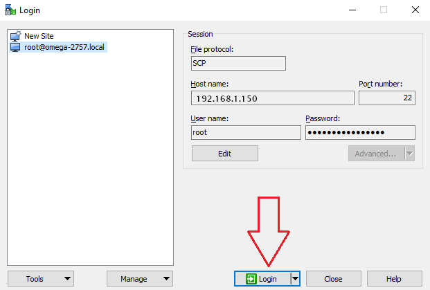

import Tabs from '@theme/Tabs';
import TabItem from '@theme/TabItem';
import CodeBlock from '@theme/CodeBlock';


:::info What we're doing in this step

Now that you’ve compiled the package, you’ll need to transfer it to an Omega so it can be installed. 

:::

You'll use the sftp protocol to transfer the ipk file from your development computer to the Omega.

**Step 1:** Install the sftp server on the Omega so it can receive the ipk file.

Connect to Omega's command line and enter the following commands:

```shell
opkg update
opkg install openssh-sftp-server
```

> See the Serial Command Line article in the quick start section of the documentation for details on working with [Omega's serial command line](../../quickstart/serial-command-line).

**Step 2:** Find Omega's IP address and note it down for use in the next step

See the [Finding the Omega's IP address article](../../networking/find-ip-address) for the procedure.

**Step 3:** Copy the ipk file from step 1 to Omega's `/tmp` directory.

<Tabs>
 <TabItem value="Mac and Linux" label="Mac OS & Linux" default>
Use the scp utility to copy the ipk file to the Omega.<br/><br/>

In the terminal outside of the Docker container.

<CodeBlock>scp output/{props.ipkFilename} root@[IP ADDRESS FROM PREVIOUS STEP]:/tmp/</CodeBlock>

For example if the IP address from the previous step was `192.168.1.150`, the command would be: 

<CodeBlock>scp output/{props.ipkFilename} root@192.168.1.150:/tmp/</CodeBlock>

When prompted, enter Omega's password `onioneer`.

 </TabItem>
 <TabItem value="Windows" label="Windows">
WinSCP is an open source free SFTP client, FTP client, WebDAV client and SCP client for Windows. You'll use Win SCP to copy the ipk file to the Omega.<br/><br/>

Download [WinSCP](https://winscp.net/eng/download.php), install it, and then run it.<br/><br/>

#### Configure the connection

Before configuring the connection, make sure your Omega has an Internet connection. If this is not the case, see the [Quickstart](../../quickstart/setup-wifi) article to set up a WiFi connection.


Configure the connection by inputting the following details in the right-hand pane.

| Setting       | Value                            |
| :------------ | :------------------------------- |
| File protocol | SCP                              |
| Host name     | **IP Address from Step 2 above** |
| Port number   | 22                               |
| User name     | root                             |
| Password      | onioneer                         |

Once finished, click **Save**. A pop-up opens that allows you to name the connection and save the password if desired. Click **OK**, to save the connection.

In the left-hand pane you'll see your newly created connection.



#### Login to Omega

Select the new connection and click **Login**, to connect to your Omega.

If you connection fails, WinSCP will let you know the host was not found. If this is the case, make sure that both your development computer and your Omega have an internet connection.

The first time you connect to WinSCP you'll get a warning message something like "*Continue connecting to an unknown server and add its host key to a cache?*". Click the **Yes** button to continue.

Once connected, you can copy the ipk file from your development computer to the `/tmp` directory on your Omega.


 </TabItem>
</Tabs>

:::note

If the dependencies for your custom package are not custom as well (they are already part of the OpenWRT SDK), then you don't need to copy those ipks over. OPKG on the Omega is smart enough to pull readily available dependencies from the package repos. In this case, it will install libcurl for you.

:::
