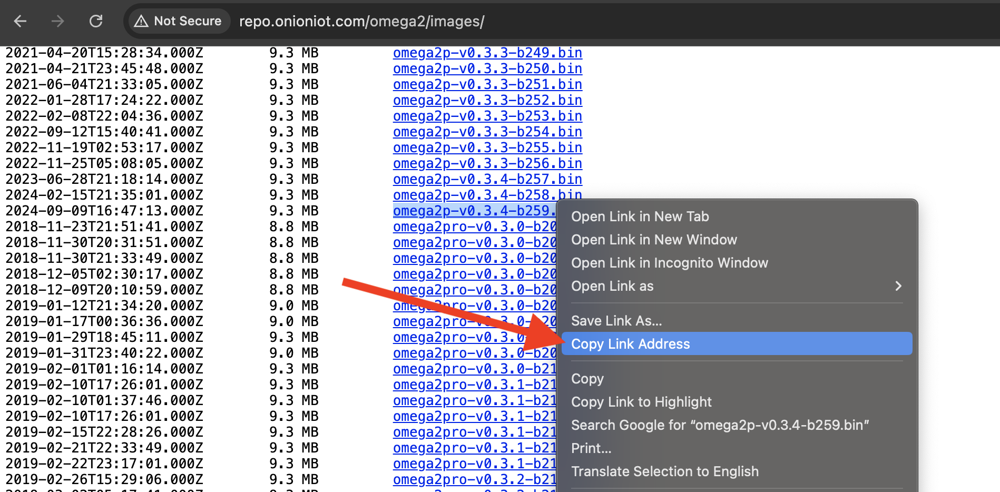

Follow this procedure to flash your Omega with the earlier v0.3.4 firmware. 

**This step is not necessary if you plan to use the new firmware.**

This is only useful if your application depends on or expects the earlier v0.3.4 firmware, and the device in use is running the new firmware based on OpenWRT 23.05. <!-- TODO: update with OPENWRT_VERSION variable -->

See the [article on identifying the firmware version](./determine-fw-version) for more information on deducing which firmware is currently installed on your device.

:::info

This procedure assumes the Omega is operating normally and successfully boots into Linux.

:::

## Step 1: Determine the Firmware Device Prefix

Firmware Images for the v0.3.4 firmware are named with this syntax: `<DEVICE>-v<VERSION>-b<BUILD-NUMBER>.bin`

Determine the device prefix using this table:

| Device                                  | Firmware Image Prefix |
|-----------------------------------------|-----------------------|
| Omega2 (OM-O2) and Omega2S (OM-O2S)     | omega2                |
| Omega2+ (OM-O2P) and Omega2S+ (OM-O2SP) | omega2**p**           |
| Omega2 Pro (OM-O2PRO)                   | omega2**pro**         |
| Omega2 LTE (OM-O2LTE)                   | omega2**lte**         |
| Omega2 Dash (OM-O2DASH)                 | omega2**dash**        |

Say you need firmware for the Omega2+, the device prefix will be `omega2p`

## Step 2: Find the URL of the Desired Firmware Image

In a web browser, navigate to http://repo.onioniot.com/omega2/images/ - this repo holds the v0.3.4 and earlier firmware images.

Using the device prefix from step 1, select which firmware image version and build you want to flash on the Omega.

Get the link of the selected firmware image by right-clicking and selecting the `Copy link address` option:


## Step 3: Download the Firmware Image to the Omega

The firmware image must be downloaded to the `/tmp` directory on the Omega. 

Connect to the Omega's command line and run the following: 

```
cd /tmp
wget <URL FROM STEP 2> 
```

Say you're interested in firmware version 0.3.4 build 259 for the Omega2+, the command would look like this:

```
cd /tmp
wget http://repo.onioniot.com.s3.amazonaws.com/omega2/images/omega2p-v0.3.4-b259.bin
```

The output of the command will look something like this:

```
Downloading 'http://repo.onioniot.com.s3.amazonaws.com/omega2/images/omega2p-v0.3.4-b259.bin'
Connecting to 52.216.208.217:80
Writing to 'omega2p-v0.3.4-b259.bin'
omega2p-v0.3.4-b259. 100% |*******************************|  9472k  0:00:00 ETA
Download completed (9699502 bytes)
```

Take note of the name of the firmware image that was just downloaded. In this example, the firmware image name is `omega2p-v0.3.4-b259.bin`.


## Step 4: Flash the new firmware

Run the following command to flash the downloaded firmware image:

```
sysupgrade -F -n -v <FIRMWARE IMAGE NAME FROM STEP 3>
```

Continuing the example, the command would be:

```
sysupgrade -F -n -v omega2p-v0.3.4-b259.bin
```

The firmware flashing will take several minutes. When the device reboots it will be running the selected firmware.