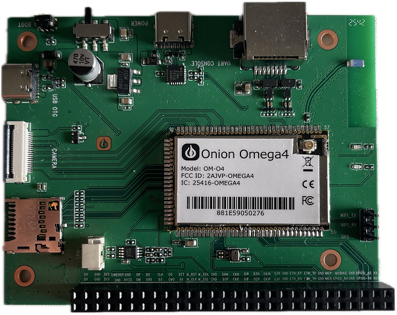

import { GiscusDocComment } from '/src/components/GiscusComment';

# Omega-4 SOM Evaluation Board — Getting Started Guide

## 1. Introduction

Welcome to the Omega-4 System-on-Module (SOM) Evaluation Platform. This guide walks you through powering up the board, accessing the Linux console, verifying network connectivity (Ethernet + Wi-Fi), and performing a simple GPIO test using the onboard LED. It assumes familiarity with embedded Linux and basic bring-up.

The Omega-4 SOM includes:

- ARM Cortex-A7 CPU
- 256 MB RAM
- 256 MB NAND Flash
- Integrated Wi-Fi 6 (2.4 GHz & 5 GHz) through a single surface-mount antenna
- Bluetooth 5
- Bootloader recovery and flashing mode support

## 2. Board Overview

<div style={{ margin: '20px 20px' }}>



</div>

### Key Connectors & Components

- USB (Serial Debug Port) — top edge; primary interface for console access.
- USB OTG Port — left side; supports host or device mode.
- BOOT Button — top-left corner; hold during reset to enter firmware flashing mode.
- Power Switch — to the right of the BOOT button.
- microSD Slot — left edge, below the OTG port.
- Ethernet Port (100 Mbps) — top-right edge.
- GPIO Header — bottom edge; exposes GPIO, I²C, SPI, etc.
- Microphone Input & Speaker Output — above the GPIO header.
- On-board LED — tied to a GPIO pin (see GPIO test below for usage).
- Single dual-band surface-mount antenna — covers 2.4 and 5 GHz Wi-Fi.

## 3. What You Need

- Omega-4 Evaluation Board (EVB) with the bundled dual-band antenna installed (no second antenna required).
- USB-A to USB-Micro/USB-C cable (depends on the serial port connector on your EVB).
- 5 V / 2 A power supply if not powering directly from a computer USB host port (host power works for bring-up).
- Ethernet cable (optional but recommended).
- Access to a Wi-Fi network for station-mode testing.
- Terminal program (PuTTY, minicom, screen, etc.).

## 4. Power-Up & Serial Console Access

### 4.1 Connect the Serial Debug Port

1. Plug the USB cable into the Serial Debug USB port on the top edge.
2. On your host machine, open your terminal program with:
   - Device: `/dev/ttyUSB*` (serial console is exposed only as a USB-UART interface).
   - Baud rate: **115200**
   - 8-N-1 settings
3. Switch Power ON.

You should see the boot logs followed by the Linux shell prompt:

```
Omega-4 login:
```

## 5. Network Bring-Up (OpenWrt Standard Configuration)

The Omega-4 uses the standard OpenWrt UCI configuration system. You can apply changes using `uci` commands or by editing `/etc/config/network` and `/etc/config/wireless`.

### 5.1 Verify Ethernet Connectivity

Check that the Ethernet interface exists:

```bash
ip link show eth0
```

Configure Ethernet as a DHCP client using the bridge device (`br-lan`):

```bash
uci set network.@device[0]=device
uci set network.@device[0].name='br-lan'
uci set network.@device[0].type='bridge'
uci set network.@device[0].ports='eth0'
uci set network.lan=interface
uci set network.lan.device='br-lan'
uci set network.lan.proto='dhcp'
uci commit network
/etc/init.d/network restart
```

Test connectivity:

```bash
ping -c 5 openwrt.org
```

If you receive replies, Ethernet is working correctly.

## 6. Wi-Fi Test (Station Mode)

### 6.1 Enable and configure Wi-Fi (OpenWrt)

Bring up the radio interface and scan for networks (requires the interface to be up):

```bash
ip link set wlan0 up
iw dev wlan0 scan
```

Configure station mode (replace `<SSID>` and `<PASSWORD>`):

```bash
uci set wireless.radio0.disabled='0'
uci set wireless.@wifi-iface[0].mode='sta'
uci set wireless.@wifi-iface[0].ssid='<SSID>'
uci set wireless.@wifi-iface[0].key='<PASSWORD>'
uci set wireless.@wifi-iface[0].encryption='psk2'
uci commit wireless
wifi
```

Define the DHCP interface if needed:

```bash
uci set network.wwan=interface
uci set network.wwan.proto='dhcp'
uci commit network
ifup wwan
```

Verify IP assignment:

```bash
ip addr show wlan0
```

Test internet connectivity:

```bash
ping -c 5 google.com
```

## 7. GPIO Test — Toggle On-board LED

If your firmware exposes the LED via `/sys/class/leds`, prefer that path. On the current image no LED entries are present; the EVB ties the onboard LED to **GPIO0A2** (numeric GPIO **2**). Use the numeric value when working with `/sys/class/gpio`.

Export the GPIO and set direction:

```bash
echo 2 > /sys/class/gpio/export
echo out > /sys/class/gpio/gpio2/direction
```

Turn the LED on:

```bash
echo 1 > /sys/class/gpio/gpio2/value
```

Turn the LED off:

```bash
echo 0 > /sys/class/gpio/gpio2/value
```

If the LED responds, GPIO functionality is verified. If your image uses the OpenWrt LED subsystem, adapt the test using `/sys/class/leds/`.

## 8. Firmware Releases

Download firmware images from the official releases page: https://github.com/OnionIoT/openwrt-omega4/releases.


## 9. Conclusion

You now have a powered Omega-4 Evaluation Board with working serial console access, verified Ethernet and Wi-Fi connectivity, and a simple GPIO LED toggle. For deeper hardware details—pinouts, electrical specs, peripheral buses—refer to the Omega-4 Hardware Reference Manual and the SOM Integration Guide.

<GiscusDocComment />
